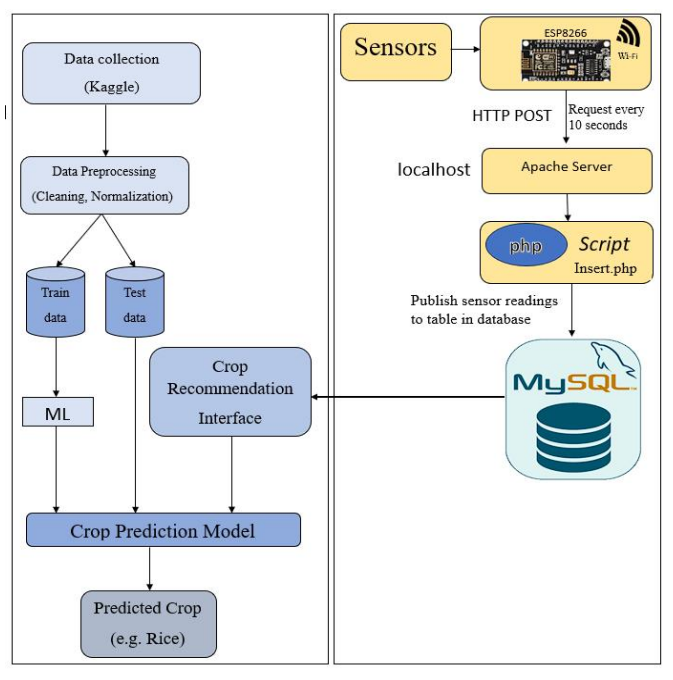

# 🌾 Crop Recommendation System using ML and IoT

## 📌 Project Overview
This project integrates **Machine Learning (ML)** and **IoT sensors** to recommend the best crops for farmers based on real-time soil and weather data.  
It consists of hardware (sensors + NodeMCU ESP8266/ESP32), software (ML models + PHP web app), and a database (MySQL - XAMPP).

---

## 🏗️ System Architecture

---

## ⚙️ Hardware Components
- 🌡️ **DHT11 Sensor** → Temperature & Humidity
- 🧪 **pH Sensor (PE03)** → Soil pH Measurement
- 🌱 **NPK Sensor** → Soil Nutrients (Nitrogen, Phosphorus, Potassium)
- 🔌 **NodeMCU ESP8266 / ESP32** → IoT microcontroller for sensor data collection
- 🔋 **Breadboard & Wires** → Circuit connections

---

## 💻 Software & Tools
- **Programming Languages**: Python, PHP
- **Database**: MySQL (XAMPP)
- **Frameworks & Libraries**: scikit-learn, pandas, numpy, matplotlib
- **IoT Platform**: NodeMCU (Arduino IDE for coding)
- **Web App**: PHP, Bootstrap, HTML, CSS
- **API**: OpenWeather API for weather forecasting

---

## 📊 Machine Learning Model
- **Dataset**: Kaggle crop dataset (soil nutrients, pH, temperature, humidity, rainfall)
- **Algorithm Used**: Random Forest Classifier (best accuracy among tested models)
- **Inputs**: Real-time sensor values + weather API data
- **Output**: Recommended crop & fertilizer suggestion

---

## 🌐 Web Application Features
- 👨‍🌾 **Farmer Login & Profile**
- 🌱 **Crop Recommendation** (based on real-time IoT + ML model)
- 💊 **Fertilizer Recommendation**
- 🌦️ **Weather Forecasting** (via OpenWeather API)
- 📈 **Rainfall Prediction** in mm
- 📊 **Sensor Data Dashboard** (real-time values from IoT sensors)

---

## 🗄️ Database Design (MySQL)
- **farmers** → Farmer profiles & login info
- **sensor_data** → Stores IoT sensor readings (pH, NPK, temp, humidity)
- **predictions** → Crop recommendation results
- **weather_data** → Weather API + rainfall prediction

---

## 🚀 Future Enhancements
- 📡 Mobile App integration for farmers
- 🌍 Multilingual farmer dashboard (regional languages)
- 🤖 Advanced Deep Learning models for better accuracy
- 📶 Offline data caching & SMS-based recommendations

---

## 📜 License
This project is licensed under the MIT License - feel free to use and modify.
